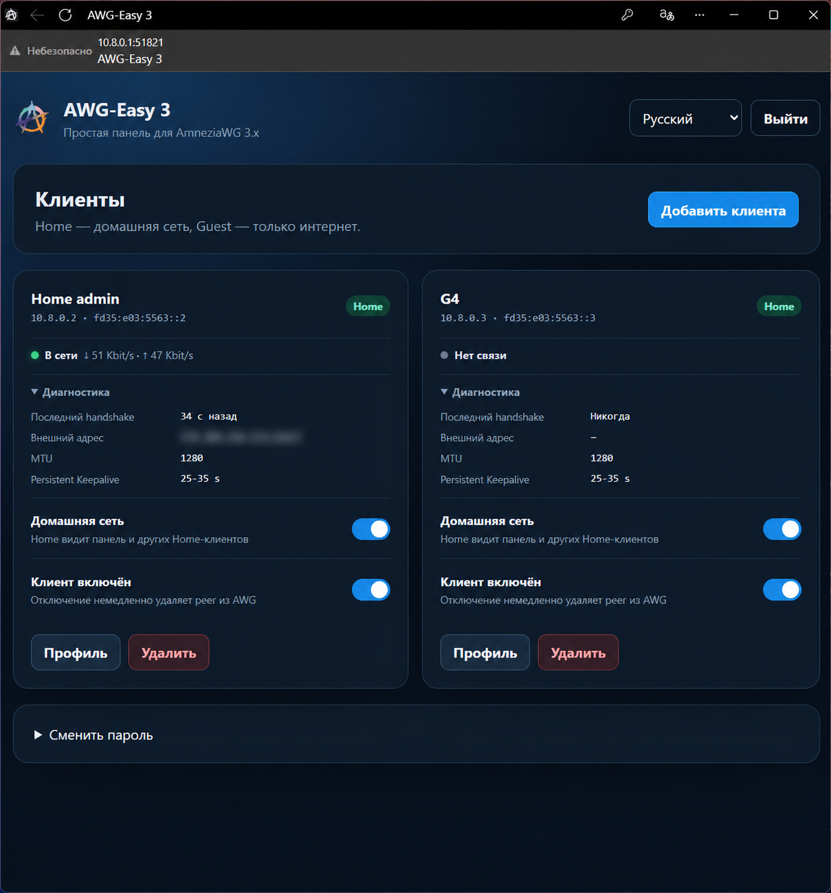

# AWG-Easy 3 (в разработке)

> Репозиторий перерабатывается в независимую некоммерческую панель для
> AmneziaWG 3.x. Проект пока не готов к установке на сервер. Текст ниже
> описывает унаследованную основу AWG-Easy 2.0 и будет заменяться по мере
> разработки.
>
> Зафиксированный объём проекта: [спецификация](docs/PRODUCT_SPEC.ru.md) и
> [архитектурные заметки](docs/ARCHITECTURE.md).

AWG-Easy 3 не является официальным продуктом AmneziaVPN и не связан с
разработчиками исходных проектов. Атрибуция приведена в [NOTICE](NOTICE).

## Унаследованная основа

[](https://github.com/JohnnyVBut/awg-easy/actions/workflows/docker-publish.yml)
[](https://github.com/JohnnyVBut/awg-easy/pkgs/container/awg-easy)
[](LICENSE)

**Самый простой способ запустить AmneziaWG 2.0 + веб-интерфейс для управления.**

Полная поддержка **AmneziaWG 2.0** с правильными параметрами обфускации, имитацией DNS-протокола и усиленным обходом DPI.

<p align="center">
  
</p>

## ✨ Возможности

* 🔐 **Полная поддержка AmneziaWG 2.0** - параметры S3, S4, I5, диапазоны H
* 🌐 **Всё в одном** - AmneziaWG + веб-интерфейс в одном контейнере
* 📱 **Простая настройка** - одна команда для запуска
* 👥 **Управление клиентами** - создание, редактирование, удаление, вкл/выкл клиентов
* 📊 **QR-коды** - мгновенная настройка клиентов через QR-код
* 📥 **Скачивание конфигов** - получение файлов конфигурации клиентов
* 📈 **Статистика** - статистика подключений и графики Tx/Rx в реальном времени
* 🎨 **Современный UI** - автоматический светлый/тёмный режим, поддержка Gravatar
* 🌍 **Мультиязычность** - поддержка нескольких языков
* 🔗 **Одноразовые ссылки** - временные ссылки для скачивания (опционально)
* ⏱️ **Срок действия клиентов** - установка даты истечения для клиентов (опционально)
* 📊 **Метрики Prometheus** - экспорт метрик для мониторинга
* 🍎 **Совместимость с macOS** - исправлены проблемы маршрутизации с маской /32

## 🎯 Чем это особенное?

В отличие от других решений WireGuard/AmneziaWG:

- ✅ **Настоящий AmneziaWG 2.0** - не AWG 1.x! Включает параметры S3, S4, I5
- ✅ **Правильные диапазоны H** - обфускация заголовков с диапазонами (не одиночные значения)
- ✅ **DNS обфускация** - преднастроенный параметр I1 для маскировки трафика
- ✅ **Production значения** - проверенные в бою параметры обфускации
- ✅ **Исправлен macOS** - маска клиента /32 для правильной маршрутизации
- ✅ **Исправлен пароль** - скорректирован парсинг bcrypt хеша

## 📋 Требования

* Хост с установленным Docker
* Публичный IP-адрес или динамический DNS

## 🚀 Быстрый старт

### 1. Установка Docker

Если Docker ещё не установлен:

```bash
curl -sSL https://get.docker.com | sh
sudo usermod -aG docker $(whoami)
exit
```

Войдите заново после установки.

### 2. Генерация хеша пароля

```bash
docker run --rm ghcr.io/johnnyvbut/awg-easy:latest wgpw 'ваш-надежный-пароль'
```

Скопируйте хеш (часть после `PASSWORD_HASH='` без кавычек).

### 3. Запуск AWG-Easy

Замените `ВАШ_IP_СЕРВЕРА` и `ВАШ_ХЕШ_ПАРОЛЯ`:

```bash
docker run -d \
  --name=awg-easy \
  --restart unless-stopped \
  \
  -e WG_HOST=ВАШ_IP_СЕРВЕРА \
  -e PASSWORD_HASH='ВАШ_ХЕШ_ПАРОЛЯ' \
  -e PORT=51821 \
  -e WG_PORT=51820 \
  -e WG_DEFAULT_DNS=1.1.1.1,8.8.8.8 \
  \
  -v ~/.awg-easy:/etc/amnezia/amneziawg \
  \
  -p 51820:51820/udp \
  -p 51821:51821/tcp \
  \
  --cap-add=NET_ADMIN \
  --cap-add=SYS_MODULE \
  \
  --sysctl="net.ipv4.ip_forward=1" \
  --sysctl="net.ipv4.conf.all.src_valid_mark=1" \
  \
  --device=/dev/net/tun:/dev/net/tun \
  \
  ghcr.io/johnnyvbut/awg-easy:latest
```

### 4. Доступ к веб-интерфейсу

Откройте в браузере:
```
http://ВАШ_IP_СЕРВЕРА:51821
```

Войдите с паролем, который вы установили на шаге 2.

> 💡 Ваша конфигурация будет сохранена в `~/.awg-easy`

## 🔧 Параметры конфигурации

### Переменные окружения

| Переменная | По умолчанию | Пример | Описание |
|------------|--------------|--------|----------|
| `WG_HOST` | - | `vpn.example.com` | **Обязательно**. Публичное имя хоста или IP VPN-сервера |
| `PASSWORD_HASH` | - | `$2y$12$...` | **Обязательно**. Bcrypt хеш для входа в веб-интерфейс |
| `PORT` | `51821` | `8080` | TCP порт для веб-интерфейса |
| `WG_PORT` | `51820` | `12345` | UDP порт для WireGuard/AmneziaWG |
| `WG_DEFAULT_DNS` | `1.1.1.1,8.8.8.8` | `8.8.8.8` | DNS серверы для клиентов |
| `WG_DEFAULT_ADDRESS` | `10.8.0.x` | `10.6.0.x` | Диапазон IP-адресов клиентов |
| `WG_MTU` | `1420` | `1380` | MTU для клиентов |
| `WG_PERSISTENT_KEEPALIVE` | `25` | `0` | Интервал keepalive (0 для отключения) |
| `WG_ALLOWED_IPS` | `0.0.0.0/0,::/0` | `192.168.1.0/24` | Разрешённые IP для маршрутизации |
| `LANG` | `en` | `ru` | Язык веб-интерфейса |

### Параметры AmneziaWG 2.0

**Преднастроены production значениями** (можно изменить через переменные окружения):

| Переменная | По умолчанию | Описание |
|------------|--------------|----------|
| `JC` | `6` | Количество мусорных пакетов |
| `JMIN` | `10` | Минимальный размер мусорного пакета |
| `JMAX` | `50` | Максимальный размер мусорного пакета |
| `S1` | `64` | Размер мусора в init пакете |
| `S2` | `67` | Размер мусора в response пакете |
| `S3` | `17` | Размер мусора в cookie reply (AWG 2.0) |
| `S4` | `4` | Размер мусора в transport message (AWG 2.0) |
| `H1` | `221138202-537563446` | Диапазон magic header init пакета |
| `H2` | `1824677785-1918284606` | Диапазон magic header response пакета |
| `H3` | `2058490965-2098228430` | Диапазон magic header underload пакета |
| `H4` | `2114920036-2134209753` | Диапазон magic header transport пакета |
| `I1` | DNS пакет | Имитация DNS протокола (tickets.widget.kinopoisk.ru) |
| `I2-I5` | Пусто | Дополнительные параметры имитации |

> 💡 **Значения по умолчанию проверены в production и обеспечивают сильную обфускацию!**

### Дополнительные функции

| Переменная | По умолчанию | Описание |
|------------|--------------|----------|
| `UI_TRAFFIC_STATS` | `false` | Включить детальную статистику RX/TX |
| `UI_CHART_TYPE` | `0` | Тип графика: 0=выкл, 1=линия, 2=область, 3=столбцы |
| `WG_ENABLE_ONE_TIME_LINKS` | `false` | Включить временные ссылки для скачивания |
| `WG_ENABLE_EXPIRES_TIME` | `false` | Включить срок действия клиентов |
| `ENABLE_PROMETHEUS_METRICS` | `false` | Включить метрики Prometheus на `/metrics` |
| `MAX_AGE` | `0` | Макс. возраст сессии в минутах (0=до закрытия браузера) |

## 🐳 Использование Docker Compose

Создайте `docker-compose.yml`:

```yaml
version: '3.8'

services:
  awg-easy:
    image: ghcr.io/johnnyvbut/awg-easy:latest
    container_name: awg-easy
    restart: unless-stopped
    
    environment:
      - WG_HOST=ВАШ_IP_СЕРВЕРА
      - PASSWORD_HASH=ВАШ_ХЕШ_ПАРОЛЯ
      - PORT=51821
      - WG_PORT=51820
      - WG_DEFAULT_DNS=1.1.1.1,8.8.8.8
      
    volumes:
      - ./data:/etc/amnezia/amneziawg
      
    ports:
      - "51820:51820/udp"
      - "51821:51821/tcp"
      
    cap_add:
      - NET_ADMIN
      - SYS_MODULE
      
    sysctls:
      - net.ipv4.ip_forward=1
      - net.ipv4.conf.all.src_valid_mark=1
      
    devices:
      - /dev/net/tun:/dev/net/tun
```

Затем запустите:
```bash
docker-compose up -d
```

## 📱 Клиентские приложения

AmneziaWG 2.0 требует совместимых клиентов:

### Android
- [Amnezia VPN](https://play.google.com/store/apps/details?id=org.amnezia.vpn) - Официальный клиент
- [AmneziaWG](https://play.google.com/store/apps/details?id=org.amnezia.awg) - Официальный AWG клиент

### iOS / macOS
- [Amnezia VPN](https://apps.apple.com/app/amneziavpn/id1600529900) - Официальный клиент
- [AmneziaWG](https://apps.apple.com/app/amneziawg/id6478942365) - Официальный AWG клиент

### Windows
- [Amnezia VPN](https://github.com/amnezia-vpn/amnezia-client/releases) - Официальный клиент
- [AmneziaWG](https://github.com/amnezia-vpn/amneziawg-windows-client/releases) - Официальный AWG клиент

### Linux
- [Amnezia VPN](https://github.com/amnezia-vpn/amnezia-client/releases) - Официальный клиент
- [amneziawg-tools](https://github.com/amnezia-vpn/amneziawg-tools) - Инструменты командной строки

> ⚠️ **Обычные клиенты WireGuard НЕ будут работать с AmneziaWG 2.0!**

## 🔄 Обновление

Для обновления до последней версии:

```bash
docker stop awg-easy
docker rm awg-easy
docker pull ghcr.io/johnnyvbut/awg-easy:latest
```

Затем запустите команду `docker run` снова.

Или с docker-compose:
```bash
docker-compose pull
docker-compose up -d
```

## 🛠️ Решение проблем

### Проблемы с подключением

Запустите диагностику:
```bash
docker exec awg-easy wg show
docker exec awg-easy iptables -t nat -L -n -v
```

### Пароль не работает

Сгенерируйте новый хеш:
```bash
docker run --rm ghcr.io/johnnyvbut/awg-easy:latest wgpw 'новый-пароль'
```

### macOS клиент не может маршрутизировать трафик

Убедитесь что конфиг клиента использует маску `/32`:
```ini
[Interface]
Address = 10.8.0.2/32  # Не /24!
```

### Логи

Просмотр логов контейнера:
```bash
docker logs -f awg-easy
```

## 📖 Документация

- [FINAL_SUMMARY.md](FINAL_SUMMARY.md) - Полный список функций и changelog
- [MACOS_FIX.md](MACOS_FIX.md) - Детали исправления маршрутизации для macOS
- [PASSWORD_FIX.md](PASSWORD_FIX.md) - Исправление аутентификации по паролю
- [REAL_CONFIG_ANALYSIS.md](REAL_CONFIG_ANALYSIS.md) - Объяснение параметров AWG 2.0

## 🙏 Благодарности

- Основано на [wg-easy](https://github.com/wg-easy/wg-easy) от сообщества wg-easy
- Интеграция AmneziaWG вдохновлена [amnezia-wg-easy](https://github.com/spcfox/amnezia-wg-easy)
- [AmneziaVPN](https://github.com/amnezia-vpn) за протокол AmneziaWG

## 📄 Лицензия

Этот проект лицензирован в соответствии с условиями лицензии, включённой в этот репозиторий.

## ⭐ Поддержка

Если этот проект вам помог, пожалуйста, поставьте звезду на GitHub! ⭐

---

**Сделано с ❤️ для безопасного и приватного доступа в интернет**
